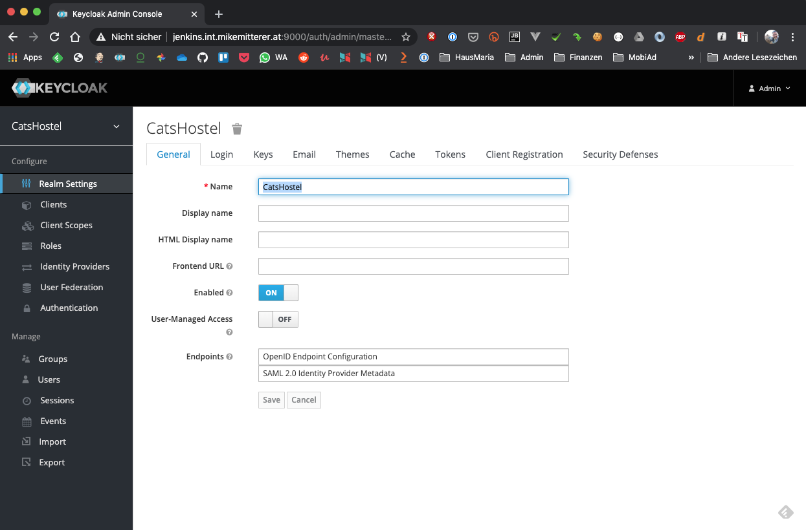

# CatsHostel - Spring Boot Version 
> [KTor-Version](https://github.com/MikeMitterer/kotlin-catshostel-kt)
> [MyBatis](https://blog.mybatis.org/)    
> [Spring Boot - Security](https://www.javainuse.com/spring/boot-jwt)  
> [Token-based API authentication with Spring and JWT](https://blog.softtek.com/en/token-based-api-authentication-with-spring-and-jwt)  
> [Spring Boot + KeyCloak](https://www.baeldung.com/spring-boot-keycloak)  
> [KeyCloak - Spring Security Adapter](https://www.keycloak.org/docs/latest/securing_apps/#_spring_security_adapter)  

## Features

   - iBatis (works with SQLite or Postgres-DB)
   - JWT support (mimics KeyCloak-Token)
   - conditional Tests (e.g. ProtectedControllerTest)
   - configurable WebSecurity (use.keycloak=true|false)  
     use.keycloak=false uses WebSecurityConfig  
     use.keycloak=true uses KeycloakConfig  
    
## UI

   - [Chat](http://localhost:8080/ws.html)  
   - [Freemarker-Template-Response](http://localhost:8080/) (StaticPages.kt)  


      
## Api

   - [Greeting](http://localhost:8080/greeting)       
   - [Greeting (Austrian style)](http://localhost:8080/servus)       
   - [Throws Exception](http://localhost:8080/exception)   
   
   - [Is alive](http://localhost:8080/api/v1)

## WebSocket (Chat)

   - [Night chat](http://localhost:8080/ws.html)   
   
Can be configured in `application.properties`

```properties
# catshostel.websocket=chatserver
catshostel.websocket=simple
```       

You can send a "Ping" via Get-Request:

   - [Ping to WebSocket](http://localhost:8080/ping)   
   
## Coroutines 

Check out my [BasicController](https://github.com/MikeMitterer/kotlin-catshostel-sb/blob/master/src/at/mikemitterer/catshostel/routes/BasicController.kt)

   - [Wait...](http://localhost:8080/wait?seconds=15)       

## Database

    # cd to DB-Directory
    cd resources/db
    
    # Import schema (Postgres works just fine here)
    sqlite catshostel.db < sqlite-1-schema.sql

Set your working dir to $MODULE_DIR$


### DB / Tests / API

   - [Show all cats](http://localhost:8080/api/v1/cat/)

## KeyCloak Settings
> [Spring Boot + KeyCloak](https://www.baeldung.com/spring-boot-keycloak)  

My additional settings:

**Valid Redirect URIs:** http://localhost:8081/*

   
   
   
   
   
   
   
   
   

## Swagger (scheint nie wirklich zu funktionieren - wurde am 2021 03 12 gedisabled)

- [HTML](http://localhost:8080/swagger-ui.html)
- [JSON](http://localhost:8080/api-docs)

Diese Variante hat am 12.3.2021 noch funktioniert:

- [Api (JSON)](http://localhost:8080/v2/api-docs)

Generell benötigt Swagger die Klasse `SwaggerConfig`.
In `GsonConfig` muss noch der `SpringfoxJsonToGsonAdapter` eingebunden werden

```kotlin
    package at.mikemitterer.catshostel.config
    
    import org.springframework.context.annotation.Bean
    import org.springframework.context.annotation.Configuration
    import springfox.documentation.builders.PathSelectors
    
    import springfox.documentation.builders.RequestHandlerSelectors
    
    import springfox.documentation.spi.DocumentationType
    
    import springfox.documentation.spring.web.plugins.Docket
    import springfox.documentation.swagger2.annotations.EnableSwagger2
    
    
    /**
     * Swagger 2 is enabled through the @EnableSwagger2 annotation.
     *
     * @since   13.05.20, 15:36
     */
    @Configuration
    @EnableSwagger2
    class SwaggerConfig {
        @Bean
        fun api(): Docket {
            return Docket(DocumentationType.SWAGGER_2)
                    .select()
                    .apis(RequestHandlerSelectors.any())
                    .paths(PathSelectors.any())
                    .build()
        }
    }
```

Der `SpringfoxJsonToGsonAdapter` sieht so aus:
```kotlin
    /**
     * Serialization-Helper for Swagger
     *
     * Mehr:
     *      http://www.programmersought.com/article/7688804471/
     *
     * @since   11.05.20, 18:30
     */
    class SpringfoxJsonToGsonAdapter : JsonSerializer<Json> {
        override fun serialize(json: Json, type: Type, context: JsonSerializationContext): JsonElement
                = JsonParser.parseString(json.value())
    }

```

### OpenAPI

- [JSON](http://localhost:8080/v3/api-docs)
   
   
